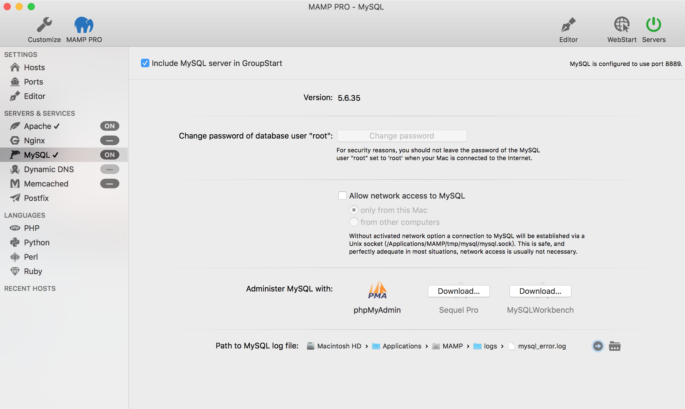
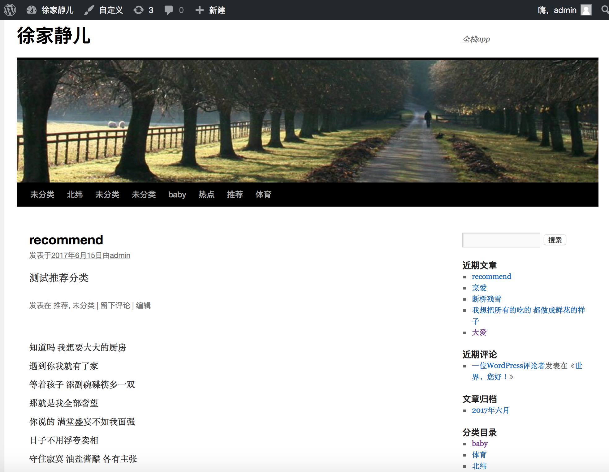

# WeChatTouTiao
微信头条全栈Swift工程，要配合wordpress+MAMP访问。动态构建分类滑动菜单，列表请求，弹幕，网页加载适配。


#微信头条app全栈中html相关处理
##环境
Mamp + Wordpress + xcode




##三方库

Wordpress（连接内置数据库php + mySql +jsonAPI）
微信公众号文章采集

- 网络抽象框架 moya
- JSON解析库 ObjectMapper
- 类似今日头条 tab: PageMenu
- 弹幕：LeoDanmakuKit
- 笑脸开关 ：LLSwitch

微信公众号文章采集 插件-DFOXW-WechatGrab微信采集助手
###swift4：可以直接使用前后三个引号这种方式来使用网页源码，类似：
```
“”“这里允许放大段的html“”“
```

###在手机上适配网站文章
手机加载的网页文章存在除了文字外还有其他内容，类似网页缩小版处理方法：需要检查wordpress网页加载后，缩放浏览器，内容是否适配，没有适配需要更换主题样式，要浏览器可以缩放适配的。

###h5移动端适配优化：(注意css优先级)

- 适配文字：在head标签加入
```
<meta name="viewport" content="width=device-width, initial-scale=1.0\">
```
- 适配图片：在head标签加入
```
<style>
 img { width:100% }
</style>
```

###去除html中的标签
给String添加扩展，外部使用字符串.htmlString

```
extension String{
    
    var htmlToAttributeString:NSAttributedString? {
        do {
            return try NSAttributedString(data:Data(utf8),options:[NSDocumentTypeDocumentAttribute:NSHTMLTextDocumentType,NSCharacterEncodingDocumentAttribute:String.Encoding.utf8.rawValue],documentAttributes:nil)
        } catch  {
            print(error)
            return nil
        }
    }
    var htmlString:String{
        return htmlToAttributeString?.string ?? ""
    }
}
```